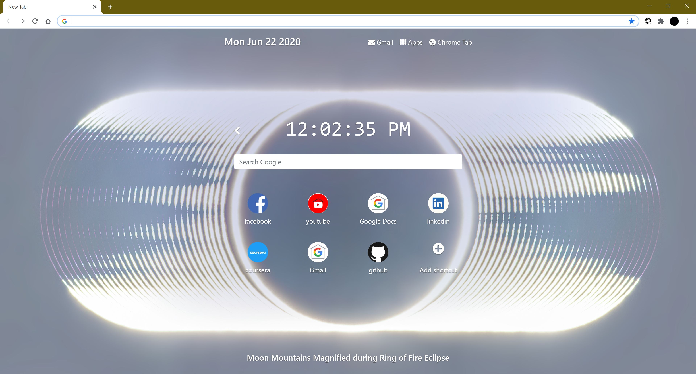
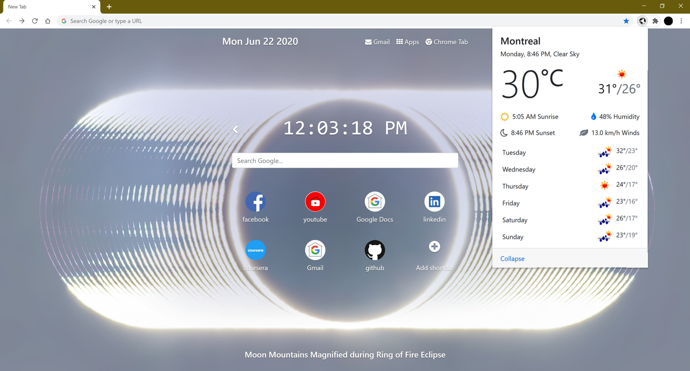
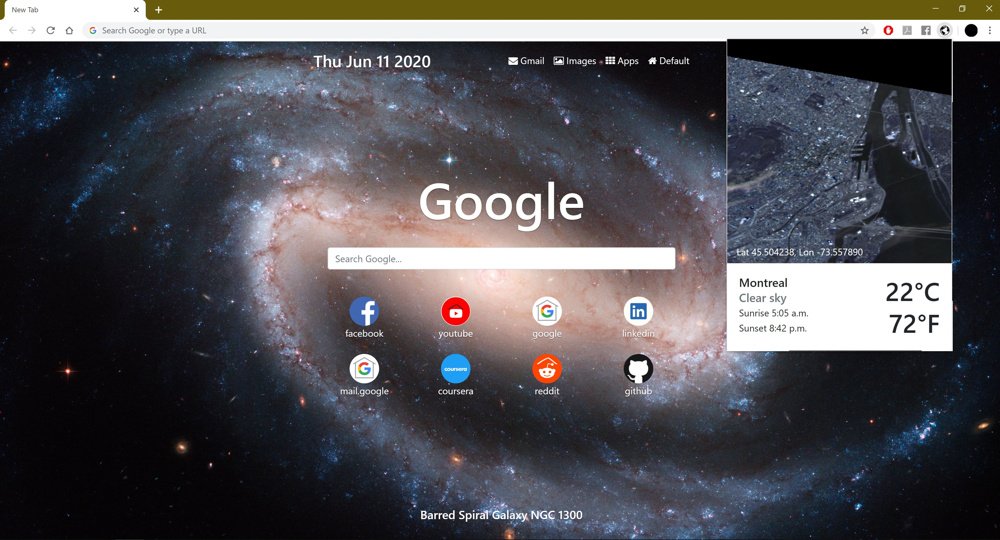
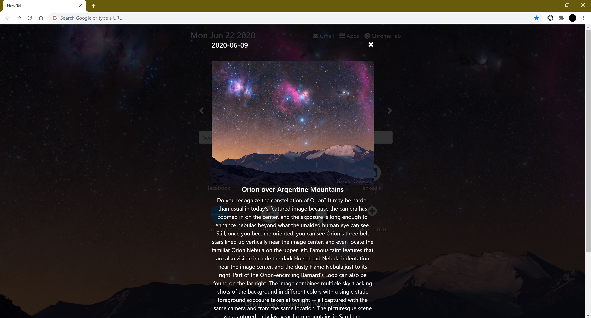
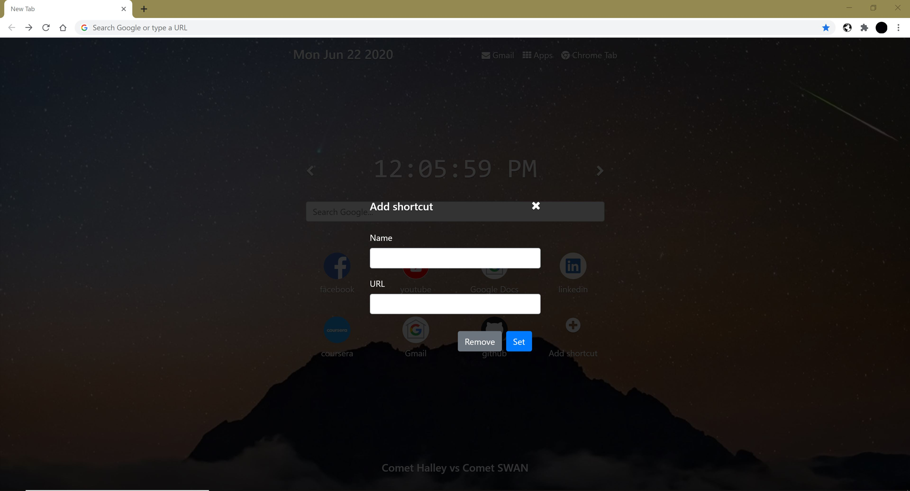
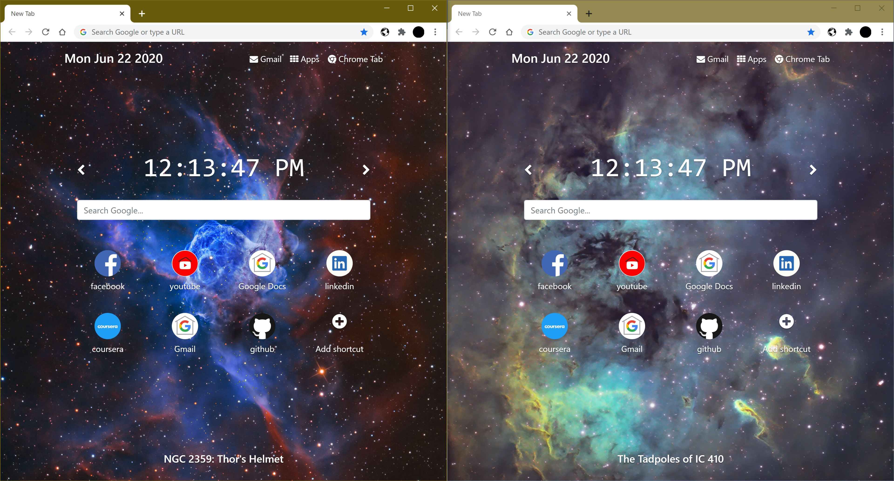
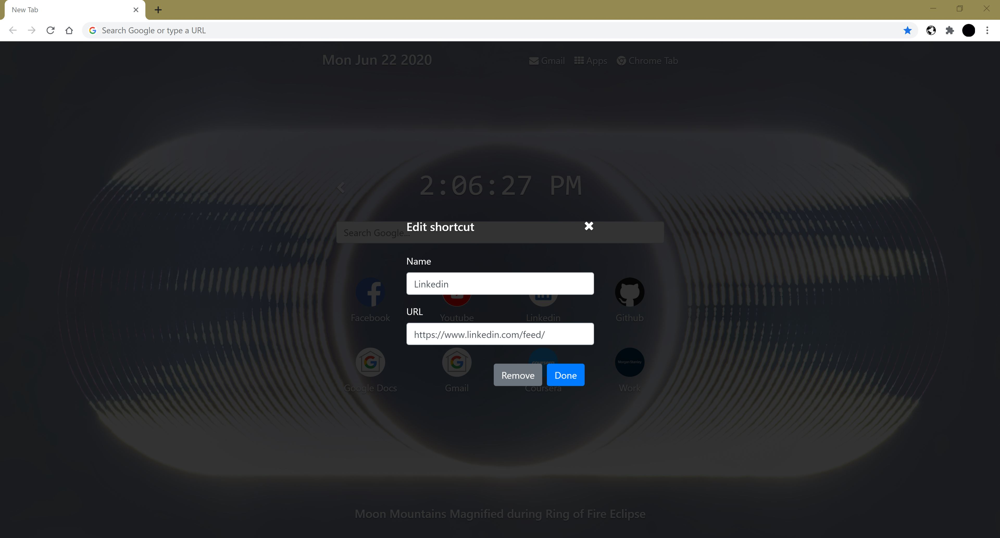

# NASA Astronomy Picture Of The Day Chrome New Tab Extension
 Fully responsive new tab chrome extension that displays NASA's astronomy picture of the day, as well as weekly weather forecast.

This app was morphed from my origional Star Wars weather chrome extension. [Can be seen here](https://github.com/PhilipPhil/Star-Wars-Weather-Chrome-Extension).

Features:
- Sets background to NASA's astronomy picture of the day.
- Links to your most visited websites.
- Editable favorites links.
- Shortcuts for gmail, apps, and the original chrome extension.
- Google search bar.
- Exact current time.
- More information modal when the title is clicked.
- Press left/right on screen arrows to rotate through past images.
- Press left/right keyboard keys to rotate through past images.
- Popup that displayes weekly weather forcasts for current location.
- Fully responsive design.

Install:
- npm install bootstrap
- npm install jquery
- npm install popper.js
- npm install font-awesome
- npm install bootstrap-social
- npm install psl

Api’s:
- Weather: openweathermap API "One Call API" and "Current Weather Data"
- Logos: clearbit Logo API
- Background Image: NASA APOD APi
- TopSites: chrome.topSites Api
- GeoLocation: Geolocation API

## Sample UI

