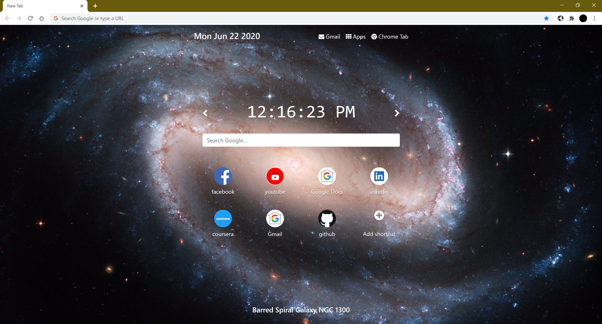

# NASA Astronomy Picture Of The Day Chrome New Tab Extension
Fully responsive new tab chrome extension that displays NASA's astronomy picture of the day, as well as the weekly weather forecast.

Can be seen in Chrome Web Store: [Nasa APOD New Tab](https://chrome.google.com/webstore/detail/nasa-apod-new-tab/enmokhdndkkdihllmldhdficglebheni/related?hl=en&fbclid=IwAR3TJLyhcGD-QubiRWHpZtsfAt1fapTduzDlZGoS_qwkK7l-JOz4OENS7_k)

Future Features:
- Toggle 24/12 hour clock.
- Toggle Celsius/Fahrenheit.
- Drag and drop favorites.
- Dynamic Icon.

Features:
- Sets background to NASA's astronomy picture of the day.
- Sets favorites links to most visited websites.
- Editable favorites links.
- Shortcuts for gmail, apps, and the original chrome extension.
- Google search bar.
- Displays date and time.
- More image information is displayed when the title is clicked.
- Press left/right on screen arrows to rotate through past images.
- Press left/right keyboard keys to rotate through past images.
- Popup that displays weekly weather forecasts for current location.
- Fully responsive design.

Install:
- npm install bootstrap
- npm install jquery
- npm install popper.js
- npm install font-awesome
- npm install bootstrap-social
- npm install psl

Api’s:
- Weather: openweathermap API "One Call API" and "Current Weather Data"
- Logos: clearbit Logo API
- Background Image: NASA APOD APi
- TopSites: chrome.topSites Api
- GeoLocation: Geolocation API

## Sample UI

